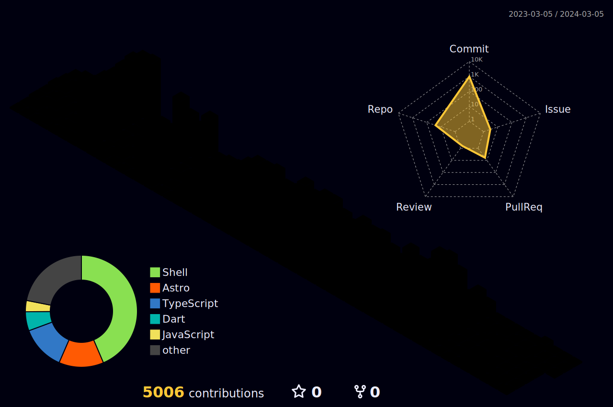

<h2><h1>   𝗜'𝗺 ELAVARASAN </h1></h2>

<em> Software Developer
  </a> 
  </em>
 

    

  
  
   
  

 &nbsp;&nbsp;
&nbsp;&nbsp; &nbsp;&nbsp;   
   <a href="https://www.buymeacoffee.com/follow.prince" target="_blank">   
    

## GitHub Profile Trophy 🏆
 

<h2> Who I am 🤔❓</h2>
    
Hi there! I'm a student, developer, and  volunteer. I believe that personal growth and learning are essential for success, and I have dedicated my life to achieving both. Because of that, I'm always looking to learn new things and apply them to whatever I'm doing. Technology is always igniting my passion for the positive impact it can have, and I'm excited to continue growing my skills and knowledge, so I started my career as a techie. In addition to my studies, I'm also passionate about giving back to various communities and helping others, which is why I volunteer my time to help out whenever I can, and I believe that this work is vital in helping to create a better future for everyone.  

## Github stats 📊 

  

  

  

<table>

## Bio
<tr><td>🤓 <b>Name</b></td><td>ELAVARASAN</td></tr>
<tr><td> 😘 <b>Nickname</b></td><td>Prince</td></tr>
        <tr><td>💼 <b>Career</b></td><td> Student |  Developer |  Volunteer</td></tr>
        <tr><td>🎒 <b>Campus</b></td><td><a href="https://www.drmgrdu.ac.in/">Dr. M.G.R. Educational And  Research Institute - Chennai</a></td></tr>
        <tr><td>🎓 <b>Course</b></td><td><a href="https://www.nibm.lk/programmes/bsc-hons-computing/">MCA - Master of Computer Applications</a></td></tr>
        <tr><td>🌐 <b>Domain</b></td><td><a href="https://elavarasan.me">www.elavarasan.me</a></td></tr>
        <tr><td>🌱 <b>Techie v1</b></td><td>2022</td></tr>
        <tr><td>🚀 <b>Techie v2</b></td><td>2023</td></tr>
        <tr><td>💫 <b>Focus On</b></td><td><a href="https://flutter.dev">Flutter</a> | <a href="https://dart.dev">Dart</a> | <a href="https://firebase.google.com">Firebase</a> | <a href="https://g.dev/follow-prince">Machine Learning</a> | <a href="https://www.python.org/">Python</a></td></tr>
        <tr><td>📄 <b>Blog</b></td><td>View my blog here 👉🏽 <a href="https://i-am-prince.vercel.app"> blog.prince.dev</a></td></tr>
        <tr><td>📌 <b>Gists</b></td><td><a href="https://gist.github.com/follow-prince">GitHub Gist</a></td></tr>
        <tr><td>🧙 <b>Support</b></td><td>Open Source | Volunteering | Helping Others | Peace | Loneliness</td></tr>
        <tr><td>💖 <b>Hobbies</b></td><td>Learning New Things | Listening to Music | Content Creation</td></tr>
        <tr><td>😍 <b>Love</b></td><td>To Make New Friends</td></tr>
        <tr><td>🌟 <b>Excellent Lines</b></td><td>வாய்ப்புகளை தேடி அலையாதே,   வாய்ப்புகளை உருவாக்கு...💯✨</td></tr>
    </table> <h2>Where you can find me 😉🔍</h2>
    <a href="https://hashnode.com/@elavarasan"></img></a> &nbsp
    <a href="https://www.linkedin.com/in/elavarasa003/"></img></a> &nbsp
    <a href="https://twitter.com/follow_prince_"></img></a> &nbsp
    <a href="https://www.youtube.com/@follow-prince"></img></a> &nbsp
    <a href="https://t.me/follow-prince"></img></a> &nbsp
    <a href="https://www.facebook.com/elavarasa003"></img></a> &nbsp
    <a href="https://instagram.com/follow.prince"></img></a> &nbsp
    <!-- <a href="https://wa.me/message/Q5YS5QJOEG6RO1"></img></a> &nbsp  -->
      
    <b>View my all profiles here 👉🏽</b> <a href="https://profile-prince-dev.vercel.app/"> profile.prince.dev</a>
    <h2>How you can contact me 😋📧</h2>
    
Hey! I appreciate you looking at my public profile. Please feel free to ask me anything or to discuss anything with me. I'm happy to chat with and meet new people. Regardless of the fact that I don't use social media much, you can find me there. So find me and get in touch with me. Send me an email if you need to discuss anything serious with me. I'll get back to you in 12 to 24 hours.

    <b>Send me an email at 👉🏽</b> <a href="mailto:elavarasa.003@gmail.com"> elavarasa.003@gmail.com</a> | <a href="mailto:contact@elavarasan.me"> contact@elavarasan.me</a>

     
 ## Support me guys
 <a href="https://www.buymeacoffee.com/follow.prince" target="_blank">   

